# Gatepass System

## Contents

- [Problem](#problem)
- [Proposed Solution](#proposed-solution)
- [Implementation](#implementation)
  - [ER Diagram](#entity-relatioship-diagram)
- [Screenshots](#screenshots)

A system which focuses on the problems faced by the students who live in hostel.

## Problem

In current system students has to ask the warden of the hostel through a hand written leave application. Students can not leave hostels until warden signs the approve it. There can be a situations when warden can not be present at the seating arrangement, such situations are blows students.

## Proposed Solution

To deal with above problem a possible solution is to digitalise the system. Student asks for leave permission through the digital system, the warden gives permission from the digital system, and the security guards scans the validity of the permission.

A implemented version of this system uses a QR as generated ticket. Each time student requests for permission to leave the a QR code is generated. This QR also expires over time.

## Implementation

### Entity Relatioship Diagram

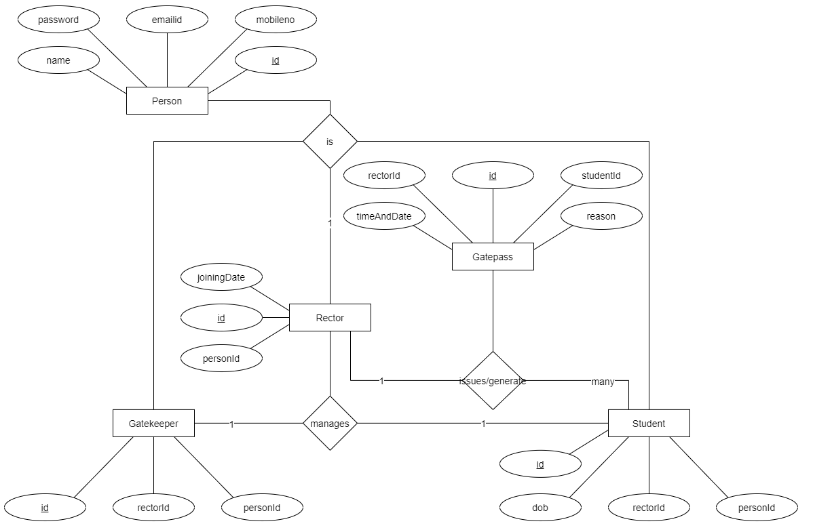

## Screenshots

### Rector's Panel (Admin Panel)

Add Student

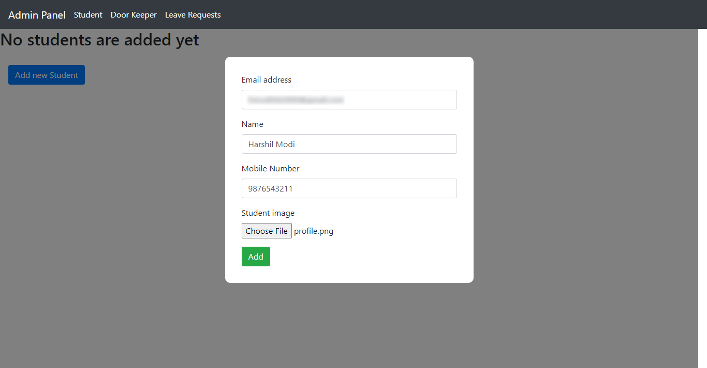

View Students

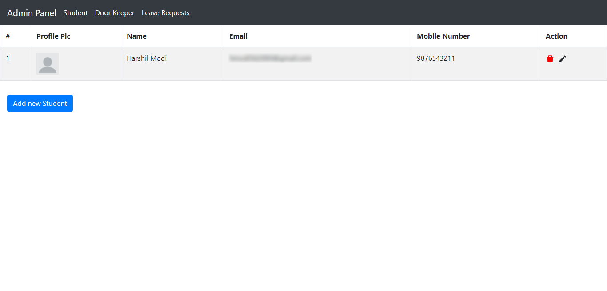

Add Doorkeeper

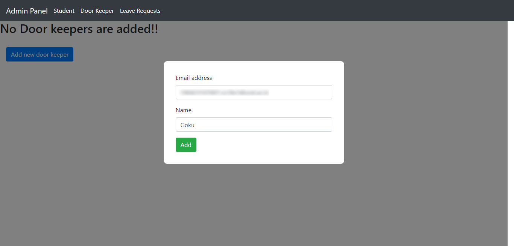

View Doorkeepers

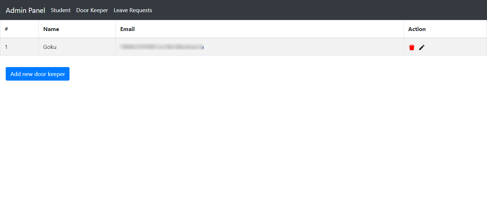

Leave Requests

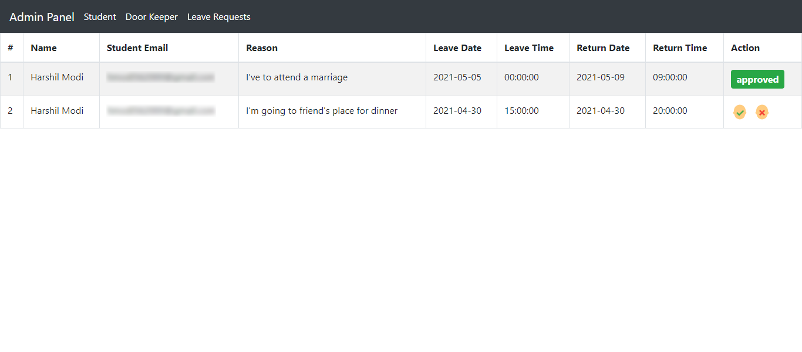

### Student's Application

<!-- YT VIDEO GOES HERE -->

Login (Before requesting for OTP)

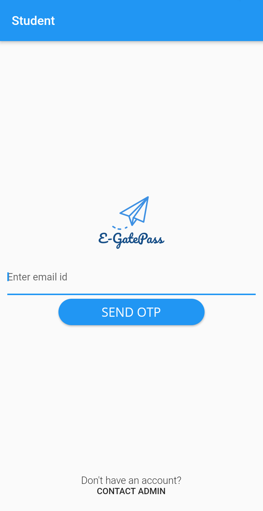

Login (After requesting for OTP)

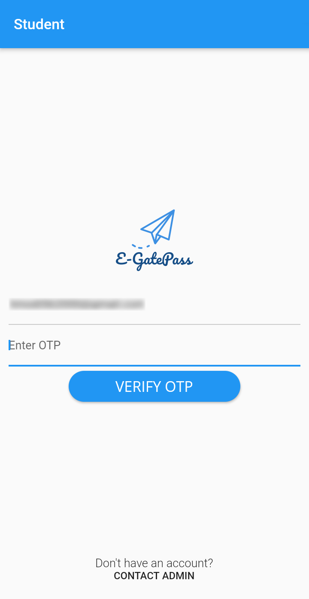

Home

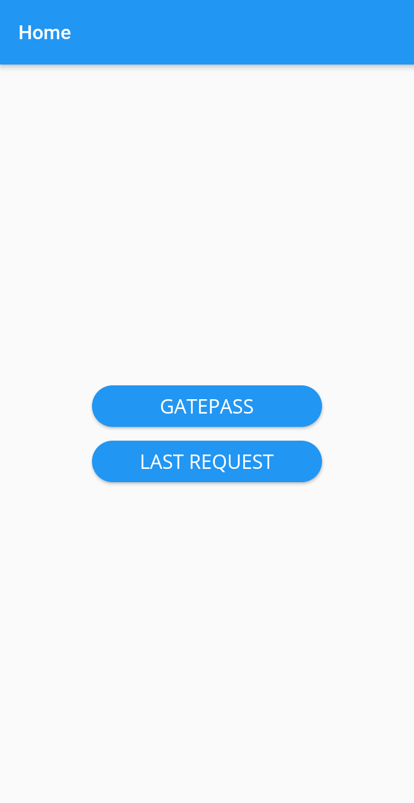

Leave Request

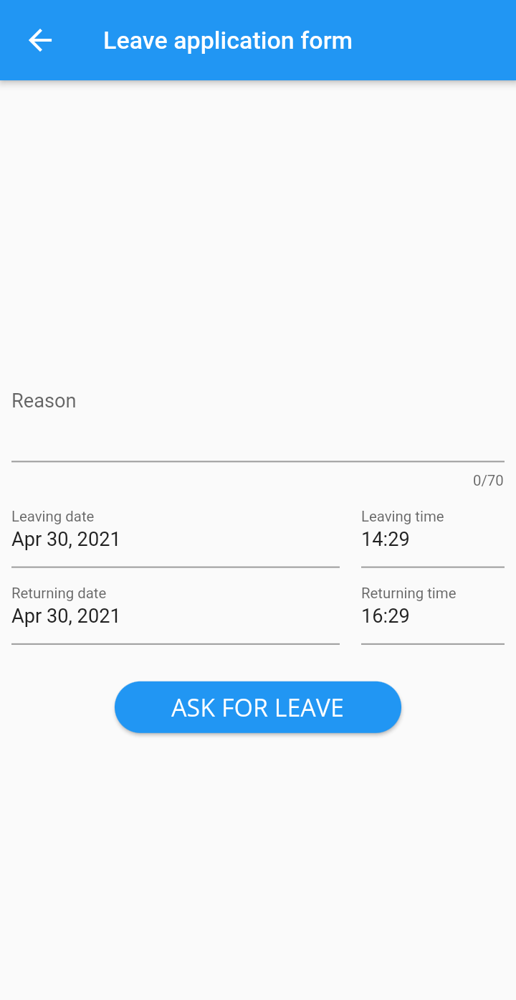

Leave Request (Status: Approved)

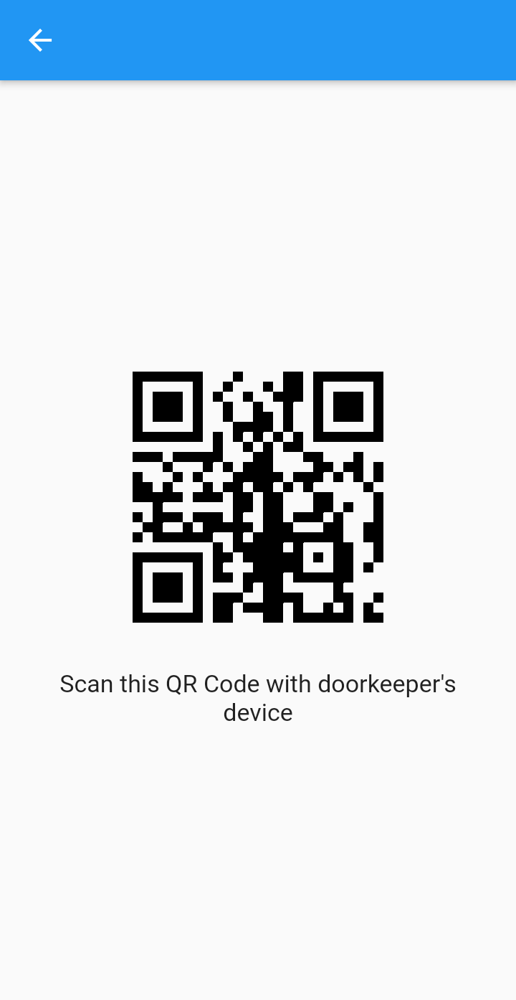

Leave Request (Status: Rejected)

### Doorkeeper's Application

Home

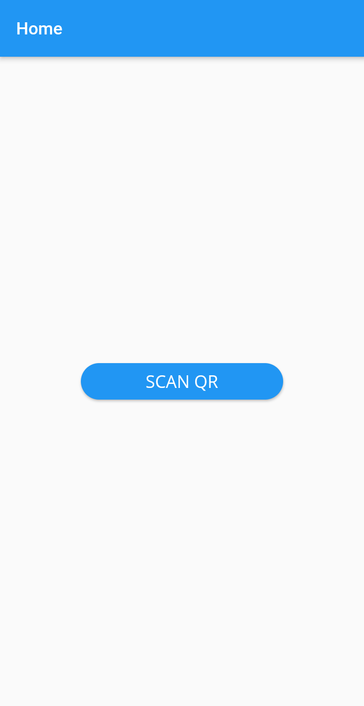

QR Scan

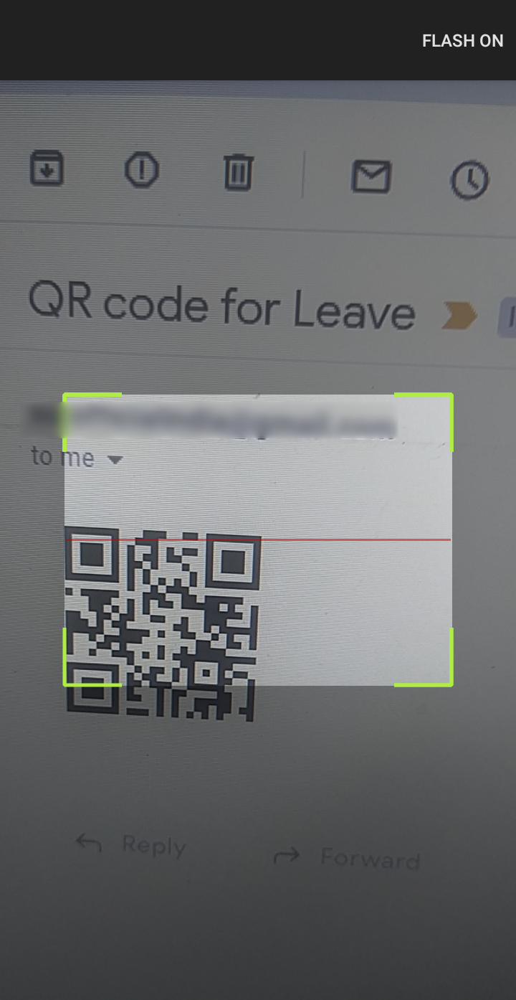

Valid QR

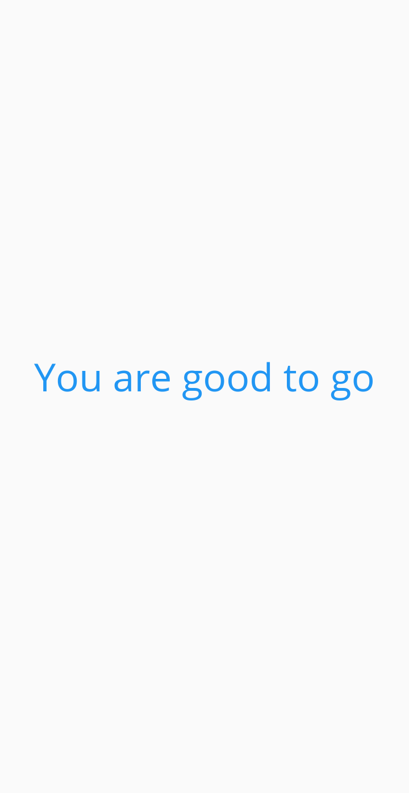

> Rector means Warden
>
> Gatekeeper, Doorkeeper means Security Guard
